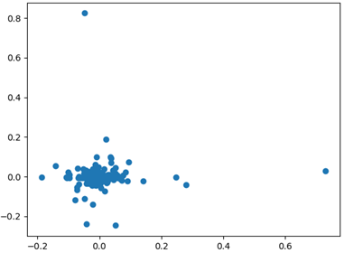
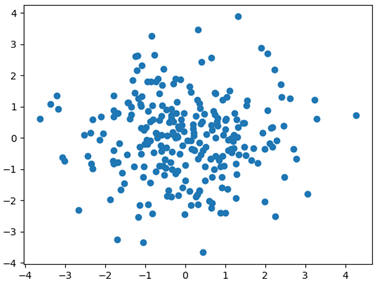
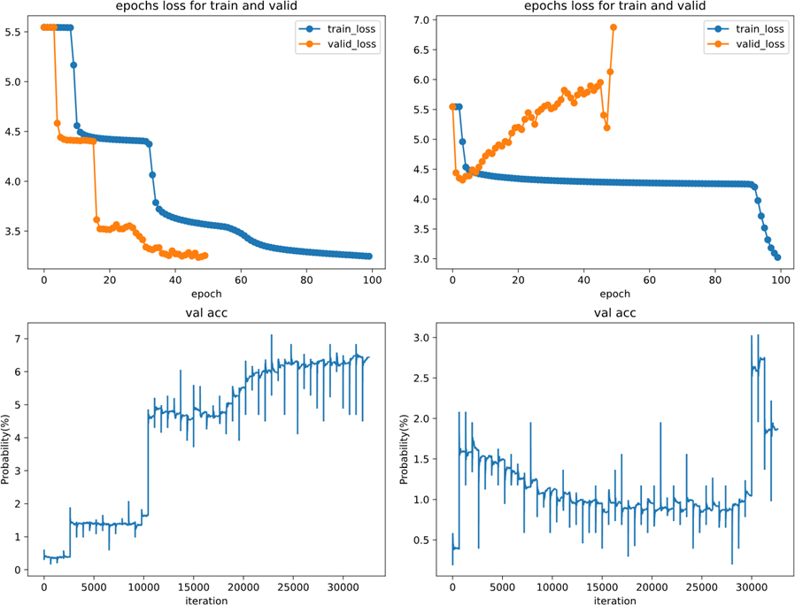
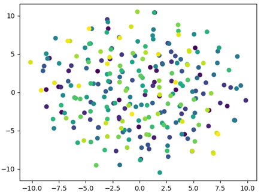
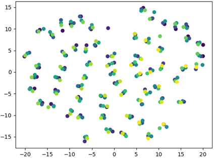

# 提升深度学习网络随机数随机性检验的能力
利用基于神经网络的机器学习预测方法，根据经典算法随机数的统计特性尝试推断经典随机数生成算法的规律，
并通过对量子随机数进行预测来进一步理解量子随机序列的随机性及量子力学的不确定性，弥补现有随机数统计检验包的评估能力受限的不足。

摘要：随机数在密码学和通信领域有着广泛的应用，它的安全性即随机不可预测性影响着整个密码系统的安全。
近年来，对于随机数随机性检验的方法不再局限于传统的基于统计的方法，其受限于数据挖据能力，对随机性的检验标准并不高。
如今，越来越多的基于机器学习的方法，用于随机数随机性检验，得益于机器学习强大的数据挖掘和模式识别能力，其有望提供一个更加严格的随机数检验基准。
同时，很多方法受限于随机数序列本身的特性，如软信息较少，序列不适合模型 训练等，模型性能受限。我们从随机序列本身出发，提出了一个增强随机数序列表达能力的新方法一词嵌入。并在基于C、的模型中通过嵌入位置编码来增强
其对时间序列时序信息的利用，提出了一种位置编码词嵌入卷积网络(Position-Embedded Word Convolution Network,PEWCN)。
实验表明，提出的方法可以有效增强模型对随机序列的建模能力。并且提出的方法具有很强的通用性，适用于基于深度学习的随机数随机性检验的研究，是一个即插即用的模块，为相关研究 提供了一个有效的解决方案。

主要贡献：
1. 提出使用词嵌入解决随机数序列软信息少的方法，并通过消融实验证明了
所提出方法对于增强随机数序列表达能力的有效性。所提方法具有很强的通用性，并且是一种即插即用的模块，为相关工作提供了一个有力的工具。
2. 提出一个融合了位置编码和词嵌入的全卷积神经网络PEWCN,通过在卷积神经网络上嵌入位置编码，赋予CNN提取时间序列时序信息的能力。通过在不同周期线性同余随机数的测试，结果显示本文提出的模型优于现有的随机性评估模型。
3. 通过可视化词嵌入矩阵，揭示了词嵌入在增强随机数序列表达能力的潜在优势。通过和One-hot编码比较对其隆维并可视化，证明了词嵌入在随机数序列
建模中的重要性。

## 一些结果
下面两张图展示了是词嵌入在随机数序列建模中的重要性。图中的结果是对输入编码后经过PCA降维后的结果，左图表示传统的方法即one-hot编码，右图表示词嵌入编码。
对于分类任务来说，显然词嵌入的特征表达要好于one-hot编码(其更分散)。

**实际实验结果**：下图示出了训练过程中训练集和验证集上损失与正确率的变化。左边两幅图是有词嵌入时 模型在$2^25$周期上训练的结果，右图是无词嵌入的结果。注意，这里训练集数量仅是周期
的1/3，并且在训练中每两轮验证一次。从图中可以看出，加了词嵌入之后模型训练损失下降比较快且在100次迭代
下能够获得接近7%的正确率，未加词嵌入的模型训练过程不平稳且正确率很难
上升，在1%附近抖动。图中正确率的抖动是统计波动引起的，计算正确率时，
是在验证集上所有序列的验证，难免在同一次验证中，很多序列预测结果同时被
“猜对”或“猜错”的情况，就会导致统计正确率时的波动。

训练后的词嵌入矩阵分布情况如下图所示：
通过比较训练前后词嵌入矩阵的分布情况，可以得词嵌入编码对模型训练的
积极影响.这里采用TSNE的隆维方法见Fig.3所示，从图中可以看出未训练前，
虽然词嵌入矩阵相比One-hot编码将类别更加分散，但是类别之间是无关联的，
对于随机数序列而言，虽然其相关性比较差，但无法说明他是无相关性的。从右
图可以看出经过训练后的词嵌入编码矩阵，使得类别之间有了联系，可以说深度
神经网络学到了这种随机数序列内部之间的弱相关性。

